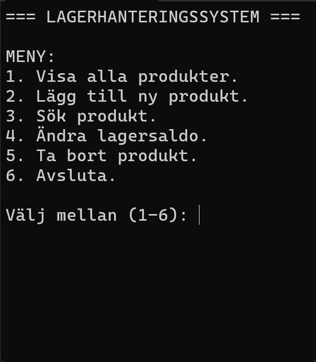

###

<h4 align="center">
This is a simple inventory management system written in C#. 
It was developed as a course exam project and uses a Swedish user interface.
</h4>

###

<h2 align="left">📦 About the project</h2>

###

This project was created as part of a programming course exam to practice and demonstrate core programming concepts.
It is a console-based application with a focus on clear structure, readability, and basic inventory logic.
  
The program allows the user to manage products in a small inventory system through a text-based menu.

###

<h2 align="left">⚙️ What the program can do</h2>

###

• View all products in the inventory 
• Add new products 
• Search for products by name 
• Change stock quantity 
• Remove products

###

<h2 align="left">💻 Technical notes</h2>

###

• Built with C# (.NET) 
• Console application 
• Object-oriented structure (classes, properties, constructors) 
• Uses lists and basic LINQ 
• Input validation and simple error handling
  
The code is written in an educational context and prioritizes clarity over optimization.

###

<h2 align="left">📸 Snapshot 📸</h2>

###

  

This repository is intended for learning and portfolio purposes and reflects my progress during a programming course.

